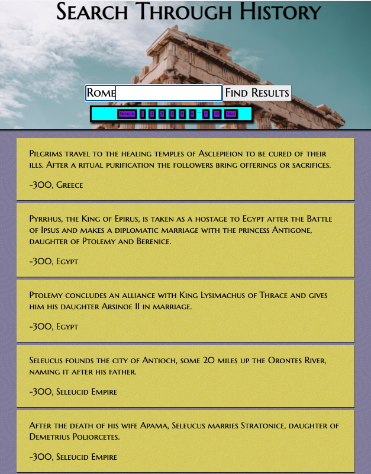

# Historical-Event-Tracker
MiniApps fullstack practice #1. Build an app to sort through messy db.json file with a json-server and React frontend.

# Set Up
> Run the following commands from the root of this repository

> npm i
> npm run build
> npm start

# Final Product

